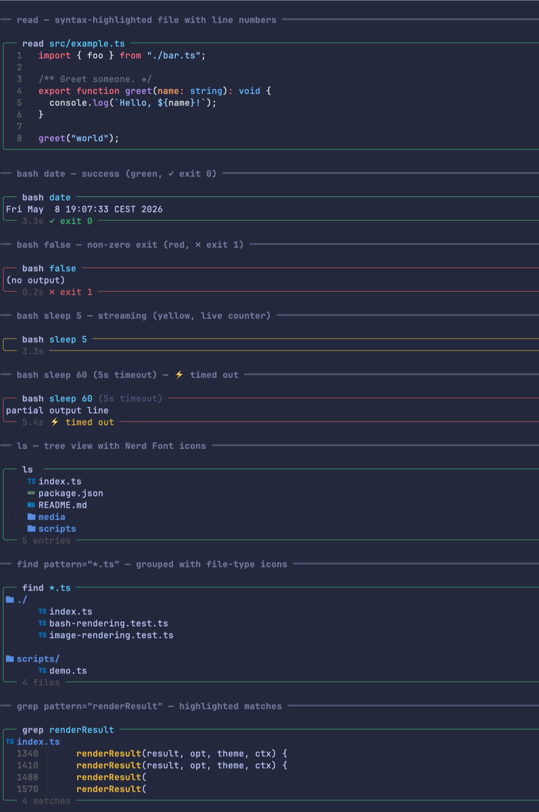

# `@wierdbytes/pi-facelift`

Cosmetic facelift for built-in [pi coding agent](https://github.com/earendil-works/pi/tree/main/packages/coding-agent)
tool output.

> inspired by [`pi-pretty`](https://github.com/buddingnewinsights/pi-pretty)




## What you get

- **`read`** — syntax-highlighted file content with line numbers, plus
  inline image rendering (Kitty / iTerm2 protocols, with tmux passthrough).
- **`bash`** — open-right frame with the duration + status pinned to the
  bottom border

  Status colour follows the host theme tokens (`success` while finished,
  `warning` while running, `error` on non-zero / timeout / abort) so the
  chrome blends with whatever palette the user is running. The exit
  summary is consistent across statuses (`✓ exit 0`, `✗ exit N`,
  `⚡ timed out`, `⚡ aborted`). Duration is shown as `3.3s` / `1m3s` /
  `2h5m`.

  > Frame primitives (top/bottom borders, rail, multi-line title
  > sub-tree) live in [`@wierdbytes/pi-common/tool-frame`][cf] and are
  > shared with `@wierdbytes/pi-web` so every tool that opts into
  > `renderShell: "self"` looks the same.

  [cf]: ../common/README.md#tool-frame
- **`ls`** — Nerd Font file icons + tree-oriented rendering.
- **`find` / `grep`** — grouped / highlighted rendering on top of pi's
  built-in tool implementations (no extra search backend, no extra
  dependencies).
- **`write` / `edit`** — GitHub-style side-by-side diff with syntax
  highlighting and word-level emphasis (powered by
  [`@wierdbytes/pi-common/diff`][cd]). All edits in one tool call share
  a single layout by default (split when every diff fits, unified when
  any would wrap) so `Edit 1 split, Edit 2 unified` mixed renders
  don't happen — configurable via `diffLayout` (see below).

  [cd]: ../common/README.md#diff

## Install

```bash
pi install npm:@wierdbytes/pi-facelift
```

## Terminal support for inline images

Inline image previews work in **Ghostty**, **Kitty**, **iTerm2**, and
**WezTerm**. Inside `tmux`, pi-facelift uses passthrough escape
sequences:

```tmux
set -g allow-passthrough on
```

(or run once in a session: `tmux set -g allow-passthrough on`)

## Configuration

### `/facelift` slash command

Run `/facelift` to open the settings overlay. Bare invocation opens the
modal; subcommands print or reset state:

| Command            | Effect                                                          |
| ------------------ | --------------------------------------------------------------- |
| `/facelift`        | Open the settings overlay.                                      |
| `/facelift status` | Print current config + the config-file path.                    |
| `/facelift reset`  | Reset every knob to defaults and persist.                       |

The overlay matches the look of `/voice`, `/web`, `/statusline` from the
same monorepo. Changes are persisted to disk immediately on each tweak.

### Config file

Per-package state lives at:

```
~/.pi/agent/wierd-facelift/config.json
```

(or `${PI_AGENT_DIR}/wierd-facelift/config.json` if `PI_AGENT_DIR` is
set). The file is seeded on first run and re-sanitised on every load,
so hand-edits with typos won't crash the extension — unknown fields
fall back to defaults.

Current schema:

```jsonc
{
  // "consistent" (default): one layout per tool call. If every diff
  //   in the call fits without excessive line wrapping → split; else
  //   → unified for all. Avoids `Edit 1 split, Edit 2 unified` mixed
  //   renders in a single edit call.
  // "split"     : always side-by-side, even when long lines wrap.
  // "unified"   : always stacked single-column.
  // "per-edit"  : each diff picks independently (original pi-diff
  //               behaviour; can produce mixed layouts).
  "diffLayout": "consistent"
}
```

### Environment variables (cosmetic knobs)

These stay env-only because they're either rendering tunables (Shiki,
icons, image protocols) or boot-time toggles:

| Variable                       | Default         | Notes                                                                         |
| ------------------------------ | --------------- | ----------------------------------------------------------------------------- |
| `FACELIFT_THEME`               | `github-dark`   | Shiki theme. Falls back to `~/.pi/agent/settings.json` `theme` if unset.      |
| `FACELIFT_MAX_HL_CHARS`        | `80000`         | Files larger than this skip syntax highlighting (still get line numbers).     |
| `FACELIFT_MAX_PREVIEW_LINES`   | `80`            | Body preview length for collapsed renderers.                                  |
| `FACELIFT_CACHE_LIMIT`         | `128`           | Max number of highlighted blocks held in memory.                              |
| `FACELIFT_ICONS`               | `nerd`          | Set to `none` / `off` to disable Nerd Font icons in `ls`/`find`/`grep`.       |
| `FACELIFT_IMAGE_PROTOCOL`      | auto            | Force `kitty` / `iterm2` / `none`. Auto-detected from `$TERM_PROGRAM` etc.    |
| `DIFF_LAYOUT`                  | (none)          | One-shot override for `diffLayout` on first-run seeding.                      |

## Development

This package lives in the [`pi-wierd-stuff`](../../README.md) monorepo.

```bash
bun install                        # from the repo root
cd packages/facelift
bun run test                       # 11 tests
bun run test:watch                 # vitest watch mode
bun run demo                       # render every tool block to your terminal
```

The `demo` script (`scripts/demo.ts`) is a visual harness — it boots the
extension with mocked SDK tools and prints every renderer (read with
live shiki highlighting, bash in success / non-zero / streaming /
timeout states, ls tree, find groups, grep matches) so you can eyeball
the open-right rounded frame, status-aware coloring, and the duration /
exit summary in the bottom border.

Typecheck (uses the global `tsc`):

```bash
bunx tsc --noEmit --target esnext --module nodenext \
  --moduleResolution nodenext --strict --skipLibCheck \
  --allowImportingTsExtensions \
  index.ts
```

## License

MIT — see [LICENSE](./LICENSE).
