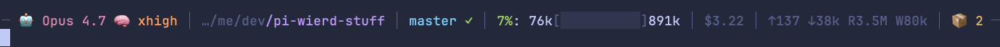

# @wierdbytes/pi-statusline

Minimal Tokyo Night Storm statusline for [pi](https://github.com/badlogic/pi-mono).
Renders a compact one-line status row above the editor, with the editor's
own top/bottom borders stripped so the two visually merge into a single
cluster.



Sections (each appears only when relevant):

- **Model** — `🤖` plus the active model's display name (e.g. `Opus 4.7`).
  `Claude ` and `anthropic/` prefixes are stripped for brevity.
- **Thinking** — `🧠` plus the current thinking level (`min`/`low`/`med`/`high`/`xhigh`),
  shown only for reasoning-capable models. Honors the model's
  `thinkingLevelMap` so providers can override the label.
- **Path** — up to the last three segments of `cwd` with a `…/` prefix.
  Parent segments in gray, current directory in purple.
- **Git** — branch name plus a clean/dirty marker (`✓` green / `✗` red).
  Hidden when not in a git repo.
- **Context** — percentage of usable context window before autocompaction
  (33k buffer reserved), printed as `pct%: used[▓░░░]remaining` with a
  colored progress bar. Color shifts green → yellow → red as you approach
  the threshold.
- **Cost** — session total in USD when greater than zero.
- **Tokens** — cumulative session input/output and cache read/write
  counters: `↑input ↓output R{cacheRead} W{cacheWrite}`.
- **Stash** — `📦 N` showing how many prompts are saved in the stash history
  (see below). Hidden when empty.
- **Subagents** — `🤖 agents N/M` chip when [`@tintinweb/pi-subagents`](https://github.com/tintinweb/pi-subagents)
  is loaded and at least one agent is active. `N` is the number currently
  running, `M = N + queued`. The chip clears as soon as every agent
  reaches a terminal state. Failures and long-running completions surface
  as one-shot toasts above the row — see [Subagents bridge](#subagents-bridge).

Inspired by [`pi-powerline-footer`](https://github.com/nicobailon/pi-powerline-footer)
by [@nicobailon](https://github.com/nicobailon) — the original brought the
statusline-as-footer idea to pi. This extension is a from-scratch take that
focuses on just that footer (skipping the bash mode, working vibes, and
welcome overlay pieces).

## Editor stash

Press `Alt+S` to save the editor's contents and clear the input, type a quick
prompt, and the stashed text auto-restores when the agent finishes — but only
if the editor is empty at that point (otherwise the stash is preserved and a
notification reminds you to clear and `Alt+S` to restore). Pressing `Alt+S`
again with text in the editor *updates* the live stash slot. The statusline's
`📦 N` indicator reflects the current stash-history depth.

Every stash is pushed onto a persisted MRU history (12 entries max, stored at
`~/.pi/agent/wierd-statusline/stash-history.json`). Press `Ctrl+Alt+S` to
open a picker overlay; navigate with arrows, `Enter` inserts the selected
entry (replace/append/cancel prompt if the editor is non-empty), `d` deletes
the selected entry, and `Esc` cancels.

## Fixed editor cluster

Off by default — enable with `/statusline fixed-editor on`. When enabled,
in interactive TUI sessions chat/feed content scrolls above the fixed
statusline, editor, and any extension-supplied widget rows. Scroll chat with
the mouse wheel, PageUp/PageDown, Command+PageUp/PageDown, or Ctrl+Shift+Up/Down;
the editor stays put. Drag text to copy it, drag a selection to the viewport
edge to scroll, double-click a line to select it, and right-click to open the
terminal context menu. Use `/statusline fixed-editor off` for pi's regular
scrolling layout, or `/statusline mouse-scroll off` for native terminal
selection.

## Install

```bash
pi install npm:@wierdbytes/pi-statusline
```

Restart pi to activate.

## Commands

- `/statusline on` — enable the statusline
- `/statusline off` — disable, restoring pi's default editor and footer
- `/statusline toggle` — toggle
- `/statusline footer on|off|toggle` — show/hide pi's built-in footer beneath the editor (hidden by default)
- `/statusline fixed-editor on|off|toggle` — keep the editor cluster fixed at the bottom while chat scrolls above (off by default)
- `/statusline mouse-scroll on|off|toggle` — enable wheel/drag scrolling and selection inside the fixed editor (on by default)
- `/statusline events [status|log|clear|toast-ms <level> <ms>]` — inspect / tune the chip+toast pipeline
- `/statusline icons [nerd-font|plain|ascii|minimal|emoji|status]` — switch the icon set used for model / thinking / stash / toast levels / subagents chip
- `/statusline subagents [status|on|off|long-ms <ms>|toast-failure <on|off>|toast-long <on|off>|toast-scheduled <on|off>]` — control the subagents bridge (see below)

## Icon sets

The statusline ships five built-in icon sets you can swap with
`/statusline icons <set>` (or via the **Icon set** field on the
Display tab of the settings overlay). The choice persists in
`~/.pi/agent/wierd-statusline/events.json`.

| Set | Sample row | Notes |
|---|---|---|
| `nerd-font` (default) | `─  sonnet-4.5  medium │ … │ master ✓ │ 45%: … │ $0.12 │  2` | Nerd Font glyphs (PUA codepoints). Requires a Nerd Font configured in your terminal. |
| `plain` | `─ ◆ sonnet-4.5 ◇ medium │ … │ master ✓ │ 45%: … │ $0.12 │ ▤ 2` | Geometric Unicode glyphs that ship with every modern font. No install required. |
| `ascii` | `- [m] sonnet-4.5 [t] medium \| … \| master ok \| 45%: … \| $0.12 \| [s] 2` | Bracketed ASCII labels. Survives broken fontconfig, ssh sessions, and log files. |
| `minimal` | `─ ▸ sonnet-4.5 ··· medium │ … │ master ✓ │ 45%: … │ $0.12 │ ≡ 2` | Single-character symbolic glyphs. Powerline / starship aesthetic. |
| `emoji` | `─ 🤖 sonnet-4.5 🧠 medium │ … │ master ✓ │ 45%: … │ $0.12 │ 📦 2` | Original pre-facelift look. Kept for users who prefer emoji. |

`git` (✓ / ✗) and the inline subagent completion / failure marks
(✓ / ✗) intentionally stay plain Unicode regardless of the active
set — they look identical everywhere and read as state, not
decoration.

## Subagents bridge

When [`@tintinweb/pi-subagents`](https://github.com/tintinweb/pi-subagents)
is installed alongside this extension, the statusline subscribes to the
`subagents:*` lifecycle events on `pi.events` and renders an aggregated
`agents N/M` chip in the chips segment whenever at least one agent is
active (the chip's icon follows the active icon set). The bridge runs
entirely on the statusline side — no changes are required in
pi-subagents itself, and the existing `🔴 Agents …` widget above the
editor keeps rendering its rich tree.

Defaults:

| Behaviour | Default |
|---|---|
| Show summary chip while agents are running | on |
| Toast on failure / abort / stop | on (error level, sticky until dismissed) |
| Toast on completions ≥ 30 s | on (success level) |
| Toast on `subagents:scheduled` | off |
| Long-completion threshold | 30 000 ms |

Tune via `/statusline subagents …`. Settings persist in
`~/.pi/agent/wierd-statusline/events.json` next to the toast-timeout map.
`/statusline subagents status` prints the live counts plus the current
config.

## Shortcuts

- `Alt+S` — stash editor text / restore stash when editor is empty
- `Ctrl+Alt+S` — open the stash history picker
